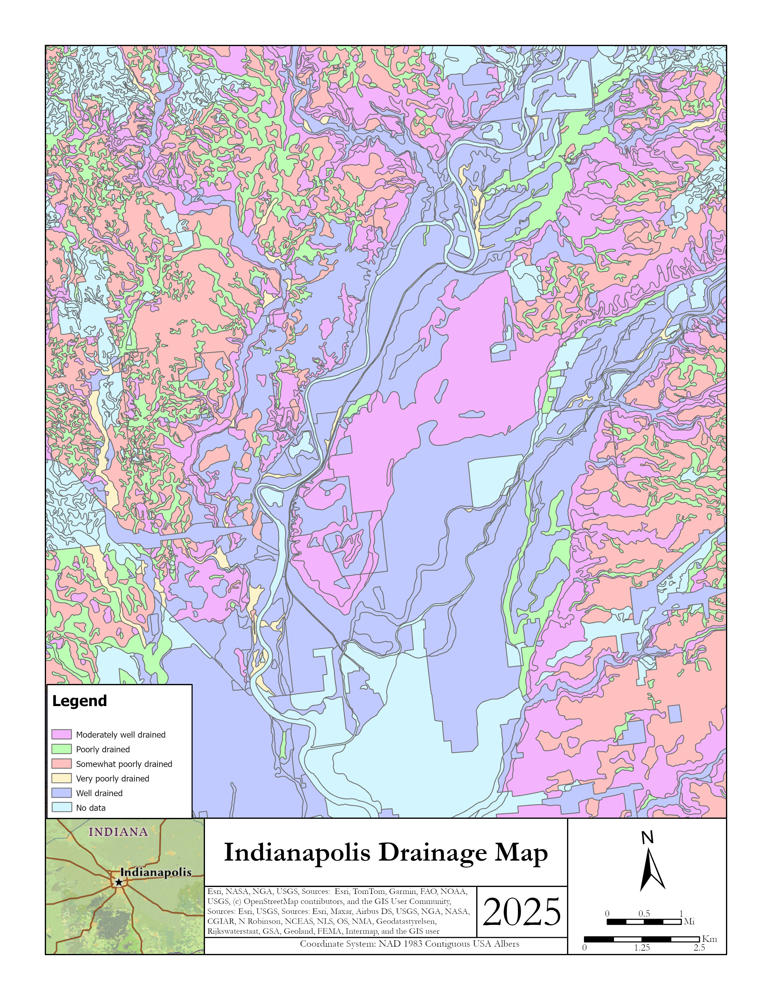

# Welcome to My Portfolio 

## About Me

I am Mudasirullah Stanikzai, a geoscience and GIS/geospatial data science professional with over 3 years of experience applying GIS in the earth science field.  
Throughout my academic and professional journey, I have applied GIS technology to both research and applied projects.  

I hold a Master’s degree in Earth Resources Science and am currently pursuing a Graduate Certificate in CyberGIS and Geospatial Data Science.  

This portfolio highlights a selection of my personal and academic projects in cartography, remote sensing, and geospatial data science.  
It does not reflect all of my work — if you would like to learn more about my GIS work, please reach out via the **Contact** section.  

  <!-- Map 1 -->
  

    
    

      This static map of Kentucky highlights major geographic and infrastructural features, 
      including parks, highways, urban areas, and selected cities. Designed in ArcGIS Pro 
      using U.S. Census and ArcGIS Online data.
    

  

  <!-- Map 2 -->
  

    
    

      This map illustrates soil drainage classes across Indianapolis using SSURGO data from USDA NRCS. 
      Soils are categorized from excessively drained to very poorly drained.
    

  

  <!-- Map 3 -->
  

    
    

      This map demonstrates linear referencing along I-65 using M-value stationing and Arcade expressions.
    

  

### Web and Interactive Maps
####  1. Ohio River NH₃-N Concentrations (1976–2024)
 
This interactive web map presents annual mean concentrations of ammonia as nitrogen (NH₃-N) mg/L in the Ohio River from 1976 to 2024. The project integrates Python-based data cleaning (see files and data in the repository), ArcGIS Pro for spatial processing, temporal analysis with time-enabled layers, and web GIS publishing via ArcGIS Online to visualize long-term water quality trends.
<iframe 
  src="https://univofillinois.maps.arcgis.com/apps/mapviewer/index.html?webmap=2fff2b5c34ba475aac118e481e43f316" 
  width="700" 
  height="500" 
  frameborder="0" 
  style="border:0;" 
  allowfullscreen>
</iframe>

## Geospatial Data Science Projects

Coming soon!

## Contact
- 📩 Email: [mudasir2.stanikzai@gmail.com](mailto:mudasir2.stanikzai@gmail.com)  
- 🔗 LinkedIn: [linkedin.com/in/mudasir-stanikzai](https://linkedin.com/in/mudasir-stanikzai)  
- 🐙 GitHub: [github.com/mudasir-st](https://github.com/mudasir-st/portfolio) 

