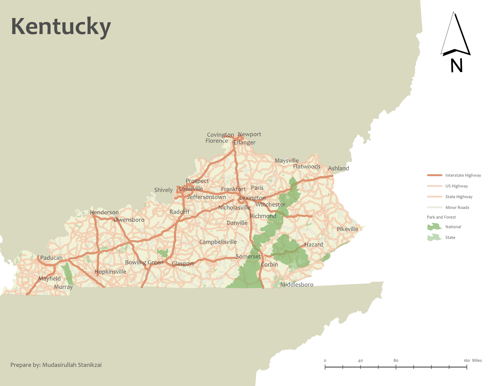

# Welcome to My Portfolio 

## About Me

I am Mudasirullah Stanikzai, a geoscience and GIS/geospatial data science professional with over 3 years of experience applying GIS in the earth science field.  
Throughout my academic and professional journey, I have applied GIS technology to both research and applied projects.  

I hold a **Master’s degree in Earth Resources Science** and am currently pursuing a **Graduate Certificate in CyberGIS and Geospatial Data Science**.  

This portfolio highlights a selection of my personal and academic projects in cartography, remote sensing, and geospatial data science.  
It does not reflect all of my work — if you would like to learn more about my GIS work, please reach out via the **Contact** section.  

## ArcGIS Projects

### Cartography and Static Maps

This static map of Kentucky highlights the state’s key geographic and infrastructural features, including parks, highways, major roads, urban areas, and selected cities. Designed and created in ArcGIS Pro using data sourced from the U.S. Census and ArcGIS Online

### Web and Interactive Maps
####  1. Ohio River NH₃-N Concentrations (1976–2024)
 
This interactive web map presents annual mean concentrations of ammonia as nitrogen (NH₃-N) mg/L in the Ohio River from 1976 to 2024. The project integrates Python-based data cleaning (see files and data in the repository), ArcGIS Pro for spatial processing, temporal analysis with time-enabled layers, and web GIS publishing via ArcGIS Online to visualize long-term water quality trends.
<iframe 
  src="https://univofillinois.maps.arcgis.com/apps/mapviewer/index.html?webmap=2fff2b5c34ba475aac118e481e43f316" 
  width="700" 
  height="500" 
  frameborder="0" 
  style="border:0;" 
  allowfullscreen>
</iframe>

## Geospatial Data Science Project

Coming soon!

## Contact
- 📩 Email: [mudasir2.stanikzai@gmail.com](mailto:mudasir2.stanikzai@gmail.com)  
- 🔗 LinkedIn: [linkedin.com/in/mudasir-stanikzai](https://linkedin.com/in/mudasir-stanikzai)  
- 🐙 GitHub: [github.com/mudasir-st](https://github.com/mudasir-st/portfolio) 

